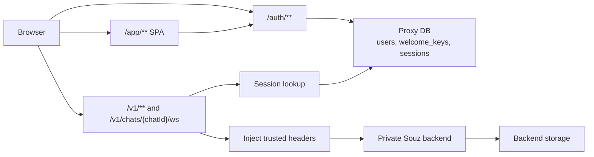

# Souz Proxy

Souz Proxy is a Kotlin/JVM Ktor application that serves the browser app, handles auth, and forwards trusted `/v1/**` traffic to the private Souz backend.

## Note for LLM

Keep this file updated whenever top-level project details change.
If you are not sure about something, leave a short note for other developers to review.

### Development principles

- Write or update tests before implementing behavior changes.
- Preserve the trusted-proxy boundary: the browser never talks to the backend directly.
- Keep browser API calls same-origin and relative: `/auth/**`, `/v1/**`, and WebSocket `/v1/chats/{chatId}/ws`.
- Do not let frontend code send or store trusted headers or session secrets.
- Keep proxy persistence limited to proxy concerns: `users`, `welcome_keys`, and `sessions`.
- Do not break the split between `/` landing content from `public-root/` and SPA content from `/app/**`.

### Security invariants

- `/v1/**` requires a valid proxy-managed session cookie.
- Proxy strips spoofable headers such as `X-User-Id`, `X-Souz-Proxy-Auth`, `Authorization`, `X-Forwarded-*`, `Cookie`, `Origin`, and hop-by-hop headers before forwarding.
- Proxy injects trusted `X-User-Id` and `X-Souz-Proxy-Auth` headers for backend requests.
- Production requires HTTPS `PUBLIC_BASE_URL`, `COOKIE_SECURE=true`, and strong `SESSION_HASH_SECRET` plus `WELCOME_KEY_SECRET`.
- Backend must stay private in Docker/Nginx deployment; only `web-proxy` publishes a host port.

## Features

- **Auth and session management**: welcome-key verification, signup, login, logout, and `GET /auth/me` backed by a dedicated proxy Postgres schema.
- **Trusted reverse proxy**: authenticated forwarding of backend HTTP routes under `/v1/**`.
- **WebSocket proxying**: same-origin `/v1/chats/{chatId}/ws` forwarding with origin allow-list enforcement.
- **Static web app hosting**: Vite/React SPA served under `/app/**` from `public/`, with old landing/static content preserved under `public-root/`.
- **Production deployment assets**: Docker multi-stage build, dev/prod Compose files, VM deploy scripts, smoke tests, and welcome-key helpers under `deploy/`.
- **Frontend app**: chat UI, onboarding, settings, provider keys, tool activity, and Telegram bot controls inside `frontend/`.

## Project Structure

```text
.
├── deploy/                                      # Production compose, VM deploy scripts, smoke tests, env templates
├── frontend/                                    # Vite + React + TypeScript SPA served under /app/**
│   ├── src/api/                                 # Browser API clients, DTO adapters, event handling
│   ├── src/app/                                 # Top-level app shell and route configuration
│   ├── src/auth/                                # Auth provider and route guards
│   ├── src/chat/                                # Chat state, reducer, socket integration
│   ├── src/components/                          # Auth/chat/settings/ui components
│   ├── src/layouts/                             # Auth and application layouts
│   ├── src/pages/                               # Login, signup, onboarding, chat, settings pages
│   └── src/test/                                # Frontend test setup and helpers
├── public-root/                                 # Root landing/static content served at /
├── scripts/                                     # Small local helper scripts
├── src/
│   ├── main/kotlin/ru/souz/proxy/app/           # App bootstrap, environment config, module wiring
│   ├── main/kotlin/ru/souz/proxy/auth/          # Auth DTOs, routes, service implementation, hashing
│   ├── main/kotlin/ru/souz/proxy/db/            # DB init and repositories
│   ├── main/kotlin/ru/souz/proxy/http/          # Health/error/static route helpers
│   ├── main/kotlin/ru/souz/proxy/proxy/         # Reverse proxy HTTP and WebSocket logic
│   ├── main/kotlin/ru/souz/proxy/security/      # Rate limiter and auth-protection helpers
│   ├── main/resources/db/migration/             # Flyway schema for users, welcome_keys, sessions
│   └── test/kotlin/ru/souz/proxy/               # Kotlin unit/integration/contract/deploy tests
├── Dockerfile                                   # Builds frontend and bundles it into /app/public
├── docker-compose.dev.yml                       # Local proxy + proxy-db + backend + backend-db stack
├── hash-welcome-key.sh                          # Wrapper around Gradle hashWelcomeKey task
└── build.gradle.kts                             # Single-module Kotlin/JVM Ktor build
```

## Runtime Flow



- `GET /` serves `public-root/index.html` when present.
- `GET /app` redirects to `/app/`.
- `/app/**` serves built frontend assets from `public/` and falls back to `public/index.html`.
- `/auth/**`, `/v1/**`, `/health`, `/healthz`, `/ready`, and `/readyz` must never be swallowed by SPA fallback.

## Important Files

- `build.gradle.kts`
- `Dockerfile`
- `docker-compose.dev.yml`
- `deploy/docker-compose.prod.yml`
- `src/main/kotlin/ru/souz/proxy/app/ProxyConfig.kt`
- `src/main/kotlin/ru/souz/proxy/http/StaticRoutes.kt`
- `src/main/kotlin/ru/souz/proxy/proxy/ReverseProxyRoutes.kt`
- `frontend/src/app/routes.tsx`

## Tests

- Kotlin test suite: `./gradlew test`
- Frontend test suite: `cd frontend && npm test`
- Frontend lint: `cd frontend && npm run lint`

Run targeted suites first when possible:

- `./gradlew test --tests ru.souz.proxy.http.StaticRoutesTest`
- `./gradlew test --tests ru.souz.proxy.proxy.ProxyIntegrationTest`
- `./gradlew test --tests ru.souz.proxy.auth.AuthRoutesRegressionTest`
- `./gradlew test --tests ru.souz.proxy.auth.AuthRateLimitIntegrationTest`
- `./gradlew test --tests ru.souz.proxy.db.ProxySchemaContractTest`
- `./gradlew test --tests ru.souz.proxy.deploy.DeploymentArtifactsTest`
- `cd frontend && npm test -- --runInBand` is not needed; use `npm test` or `npm run test:watch`

Test intent by area:

- `ProxyConfigTest` guards production env validation and secret requirements.
- `AuthServiceTest` covers welcome-key usability edge cases.
- `AuthRoutesRegressionTest` covers cookie-setting auth contract.
- `AuthRateLimitIntegrationTest` covers rate limiting for login/signup/welcome verify.
- `StaticRoutesTest` covers `/app/**` serving and fallback boundaries.
- `ProxyIntegrationTest` covers header stripping, request forwarding, and WebSocket proxy behavior.
- `ProxySchemaContractTest` ensures proxy DB scope stays limited.
- `DeploymentArtifactsTest` protects Docker/Compose/deploy assumptions.

## Local Development

- Start backend/proxy stack: `docker compose -f docker-compose.dev.yml up --build`
- Run proxy locally: `./gradlew run`
- Run frontend dev server: `cd frontend && npm install && npm run dev`
- Create a welcome-key hash: `./hash-welcome-key.sh <raw-key>`

Useful local URLs:

- `http://localhost:8080/` - root landing content from `public-root/`
- `http://localhost:8080/app/` - browser SPA
- `http://localhost:8080/health` - liveness
- `http://localhost:8080/ready` - proxy plus dependency readiness

## Deployment Notes

- Production compose lives in `deploy/docker-compose.prod.yml`.
- `web-proxy` is the only service that should publish a host port.
- Nginx should route `/app/**`, `/auth/**`, and `/v1/**` to the proxy container while serving the public landing separately.
- Frontend is built in the Docker image and copied into `/app/public`.
- Backend image needs stable `SOUZ_MASTER_KEY` and `TELEGRAM_TOKEN_ENCRYPTION_KEY`; do not rotate them casually.
